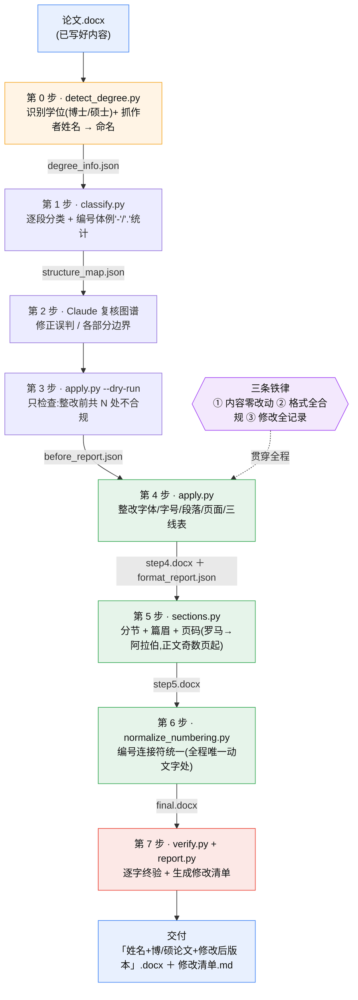

# thu-graduate-thesis-format-skill

清华大学研究生学位论文(博士/硕士)格式自动整改 [Claude Skill](https://docs.claude.com/en/docs/agents-and-tools/agent-skills/overview)。

依据《清华大学研究生学位论文写作指南》(研究生院,2025年3月版),在**不改动任何文字内容**的前提下,把已写好的论文 `.docx` 自动整改为符合学校格式规范的文档,并生成逐条修改清单供核对。

## 流程一览

学位识别(第 0 步)+ 七步整改,全自动顺序执行;博士与硕士走同一条流水线(正文规范相同,差异只在封面)。



## 它做什么

读取你写好的论文 docx,自动完成:

- **学位类型识别 + 文件命名**:读取封面与前置页,依据中文封面学位类别行("……博士学位论文"/"……硕士学位论文")与英文封面学位行("Doctor of Philosophy"/"Master of …")自动判定博士/硕士、学术/专业学位,并从封面"申请人/研究生"栏抓取作者姓名,据此把最终文件命名为「姓名+博士/硕士论文+修改后版本」,全部写入 `degree_info.json`。博士与硕士**正文格式规范完全相同**,差异只在封面与学位标识,后续整改流程对博硕一致
- **学校模板专用版式整段保留**:封面(专用页边距 6/6/4/4、5.5/5/3.6/3.6 与信息表/名单表)、符号和缩略语说明、个人简历及学术成果等模板版式**完全不动**,只整改正文该改的部分,不会把封面压扁、清单撑开
- **章节智能识别**:既认"第N章/N.M"文字编号,也认 Word 自动编号 / 标题1-标题4 样式(大纲级别);正文里以"第N章…"开头的长句不会被误判成章标题
- **字体字号**:章标题/节标题/正文/图表题注/公式/参考文献等各类段落,按规范分别设置中西文字体与字号(仅当继承到的有效字体≠规范时才改,不把直接格式写满全文)
- **段落格式**:对齐方式、行距(单倍/固定值)、段前段后间距、首行缩进、悬挂缩进
- **页面设置**:页边距 3.0/3.0/3.0/3.0 cm、页眉页脚距 2.2 cm
- **分节、篇眉与页码**:自动按各部分插入分节符,篇眉=该部分章标题(自动编号的章会补回"第N章 …")、下加 0.75 磅细横线,摘要起罗马数字、正文第1章起阿拉伯数字且从奇数页开始;封面/英文封面/名单/授权/摘要置于奇数页(单面打印自动补空白页);整体清空页眉页脚容器(含模板 `w:sdt` 页码)避免同页出现两个页号;写入 `updateFields` 让 Word 打开自动刷新目录页码
- **表格**:有数字的数据表画三线表(上下 1.5 磅、表头下 1 磅、清内线);为排版图/子图的布局表识别为**透明无边框**;封面/名单等模板表保留不动
- **图表公式编号体例**:**图/表 与 公式 是两套独立序列**(图表用 "."、公式用 "-"),分别统计、各自统一,只在某一套自身混用时才改(全流程唯一允许的文字改动,逐条记录)
- **终验**:整改前后全文逐字比对,确保除已授权的编号连接符外,内容完全一致

## 它不做什么

- 不生成或重排**封面、符号说明、个人简历等模板内容**(题目/姓名/导师签名等)——这些学校模板版式整段保留,只保证不被破坏
- 不涉及打印设置(双面打印由打印机完成,文档侧的奇偶分页已通过分节符保证)
- 不重写参考文献内容、不改图表数据——只调整格式

## 从 GitHub 到使用

如果你是在 GitHub 上看到这个项目,按下面方式安装后即可在 Claude 中使用。

### 方式 A:Claude.ai 网页/桌面端

1. 打开项目页面:[ZidingWang/thu-graduate-thesis-format-skill](https://github.com/ZidingWang/thu-graduate-thesis-format-skill)。
2. 下载 `dist/thu-graduate-thesis-format.skill`:
   - 若项目有 Release,优先在 Release 中下载 `.skill` 文件。
   - 若没有 Release,进入仓库的 `dist/` 目录,打开 `thu-graduate-thesis-format.skill`,点击下载原始文件。
3. 打开 Claude.ai 或 Claude 桌面端,进入 `Settings` → `Capabilities` → `Skills`。
4. 上传刚下载的 `thu-graduate-thesis-format.skill`。
5. 新建对话,上传你的论文 `.docx`,对 Claude 说:

> 帮我把这篇研究生学位论文(博士或硕士)按清华学校格式整改一下

Claude 会自动调用本 skill,生成整改后的 `.docx`、逐条 `修改清单.md` 和内容完整性校验结果。

### 方式 B:Claude Code

```bash
mkdir -p ~/.claude/skills
git clone https://github.com/ZidingWang/thu-graduate-thesis-format-skill.git \
  ~/.claude/skills/thu-graduate-thesis-format
pip install -r ~/.claude/skills/thu-graduate-thesis-format/requirements.txt
```

安装后,在 Claude Code 对话中上传或指定论文 `.docx`,说类似:

> 帮我把这篇研究生学位论文(博士或硕士)按清华学校格式整改一下

Claude Code 会自动调用本 skill,依次完成解析分类、格式整改、分节分页、编号统一、终验,并交付:

- 整改后的 `.docx`
- `修改清单.md` —— 逐条记录每一处修改(位置 + 属性 + 旧值 → 新值)
- 内容完整性校验结果

### 依赖说明

脚本依赖 `python-docx` 和 `lxml`。Claude Code 用户可用 `requirements.txt` 安装;Claude.ai/桌面端上传 `.skill` 后,Claude 会在可用环境中按 skill 指令调用这些脚本。

## 目录结构

```
thu-graduate-thesis-format/
├── README.md                      # 项目说明与安装方式
├── LICENSE                        # MIT License
├── requirements.txt               # Python 依赖
├── SKILL.md                       # 工作流定义(学位识别 + 七步整改,全自动)
├── references/
│   ├── format-spec.md             # 完整格式规范参数表(字体/字号/行距/磅值/页面)
│   └── document-structure.md      # 论文组成部分顺序与各部分要点
├── scripts/
│   ├── spec.py                    # 规范常量(与 format-spec.md 一致)
│   ├── detect_degree.py           # 识别学位类型(博士/硕士、学术/专业)→ degree_info.json
│   ├── classify.py                # 解析论文,逐段分类生成结构图谱
│   ├── apply.py                   # 整改字体/段落/表格,内置完整性校验
│   ├── sections.py                # 分节、篇眉、页码自动化
│   ├── normalize_numbering.py     # 图表公式编号体例统一
│   ├── verify.py                  # 整改前后终验
│   └── report.py                  # 生成修改清单 Markdown
└── evals/
    └── make_sample.py             # 生成测试样本(支持 --degree 博士/硕士)
```

> 打包为 Claude.ai 可上传的 `dist/thu-graduate-thesis-format.skill` 时,把上述目录压缩为 `.skill` 包即可(按方式 A 的下载路径放置)。

## 开发与验证

生成一份格式故意不合规的测试论文(可用 `--degree` 选择博士或硕士样本,二者正文规范相同):

```bash
python evals/make_sample.py --degree 博士 -o sample_thesis.docx   # 或 --degree 硕士
```

先识别学位类型,再按 `SKILL.md` 中的七步流水线整改、终验:

```bash
python scripts/detect_degree.py sample_thesis.docx -o degree_info.json
python scripts/classify.py sample_thesis.docx -o structure_map.json
python scripts/apply.py sample_thesis.docx -m structure_map.json -o step4.docx -r format_report.json
python scripts/sections.py step4.docx -m structure_map.json -o step5.docx -r sections_report.json
python scripts/normalize_numbering.py step5.docx --auto -o final.docx -r numbering_changes.json
python scripts/verify.py sample_thesis.docx final.docx --allow-numbering   # 期望:终验 PASS
python scripts/report.py format_report.json -o 修改清单.md
```

## 适用范围与局限

- 基于学校 2025 年 3 月版《写作指南》提炼,若学校后续更新版本导致规范数值变化,请更新 `references/format-spec.md` 与 `scripts/spec.py`
- `classify.py` 基于正则与启发式规则分类段落,结构特殊的论文(著者-出版年制参考文献、人文社科脚注体系、复杂分图等)可能需要人工修正结构图谱后再继续
- `detect_degree.py` 依据封面/前置页的学位标识判定博士/硕士;若封面单独成文件、未随正文上传,`degree_info.json` 的 `confidence` 会标为 low/none,此时需人工确认学位类型(无论博硕,正文整改流程相同)
- 院系如有比学校规范更严格的额外要求,以院系要求为准,本 skill 仅保证符合研究生院统一规范

## License

MIT,见 [LICENSE](LICENSE)。
